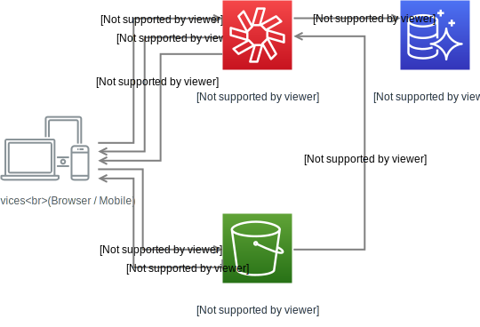

# Object Storage based on Postgres and S3

This Spring Boot application shows, how documents and images can be managed using a combination of
a relational database (e.g. PostgreSQL) and a S3 object storage (AWS S3, Minio), where the S3 storage
is directly exposed as a tier-2 system.

All the logic (e.g. authorization) is held in a relational database (tier-3) and served by a tier-2 Spring Boot
REST service. The S3 storage is used directly by the clients (browser) using **pre-signed URLs**.

## The application

Screenshot of the application's user interface


## Architecture

Flow for upload of documents:



1. Client sends meta-data of document to application service (POST) and saves it to the application's database
2. Client receives pre-signed URL to write document content (PUT)
3. Client uses PUT to upload document content to S3 object storage
4. Client receives HTTP 200 on success
5. Object Storage publishes PUT events (`s3:ObjectCreated:Put`) via
   - AQMP, Kafka, WebHooks, ... in case of using private minio or Ceph
   - SQS, Lambda (in case of using public AWS S3)
6. Application service
   - receives PUT event
   - finalizes meta data (content length, mime type, ...) to database
   - creates a thumbnail (not shown in diagram)
   - and sends "ready" event back to browser client using WebSocket/STOMP

## Web Socket and STOMP

- the frontend uses [sockjs-client](https://www.npmjs.com/package/sockjs-client) to allow websockets also on older (non ES5) browsers
- the frontend uses [webstomp-client](https://www.npmjs.com/package/webstomp-client)
- the used STOMP protocol is `V1.2`
- STOMP heart beats are on default rate for incoming / outcoming at 10 seconds / 10 seconds
- The data returned by the application to the browser client on receiving an S3 event is currently a simple JSON
  with a command (`thumbnailReady` when the asynchronous thumbnail creation process is done) and the full document object.

```json
{
    "event": "thumbnailReady",
    "document": {
        "id": 123,
        ...
    }
}
```

###

## Local Setup with Minio

The default setting

- assumes minio runs on port `9999`
- is using a bucket named `bucket-001`
- uses `minio-local` as an alias
- uses _WebHook_ for bucket event notification

Start minio. Here on a local IP 192.168.178.45 with port 9999 - this IP and port is also pre-configured
in [application-dev.yml](src/main/resources/config/application-dev.yml) - **You have to chance this, matching your setup!**

```
export MINIO_ACCESS_KEY=minio
export MINIO_SECRET_KEY=miniosecret
export MINIO_REGION_NAME=default
./minio server --address 192.168.178.45:9999 data
```

```
# [Optional] Check existing server aliases
./mc alias list
# [Optional] Remove existing server alias
./mc alias remove minio-local
# Configure the server's new alias
./mc alias set minio-local http://192.168.178.45:9999 minio miniosecret --api "S3v4"
# Check minio content
./mc ls minio-local
# Remove the bucket, if it exists
./mc rb minio-local/bucket-01 --force
# Create bucket
./mc mb minio-local/bucket-01 --region default
# Check version
./mc --version
# Update minio to latest version
./mc update

# Add/Replace webhook
./mc admin config set minio-local/ notify_webhook:1 enable="true" endpoint="http://localhost:8080/event-api/s3/"
> Setting new key has been successful.
> Please restart your server with `mc admin service restart minio-local/`.

# Restart server
./mc admin service restart minio-local/
# Will show
AccessKey: minio
SecretKey: miniosecret
Region:    default
SQS ARNs:  arn:minio:sqs:default:1:webhook

# Add event filter to configuration
./mc event add minio-local/bucket-01 arn:minio:sqs:default:1:webhook --event put
Successfully added arn:minio:sqs:default:1:webhook

# Check events
./mc event list minio-local/bucket-01
arn:minio:sqs:default:1:webhook   s3:ObjectCreated:*   Filter:

# Remove event
./mc event remove minio-local/bucket-01 arn:minio:sqs:default:1:webhook

```

## TSLint/ESLint

Temporary or permanent switch off rules per line or per file:

```
// eslint:disable-next-line:no-console
// eslint:disable:no-console

// eslint-disable-next-line @typescript-eslint/no-unused-vars
// eslint-disable @typescript-eslint/no-unused-vars
```

## Change log

- 10.07.2022 (0.7.0-SNAPSHOT)
  - Refactoring of the WebSocket/Stomp part
  - Application property `userBasedWebSocket` (currently false) for future non-broadcast based solutions
  - curl scripts for simulating S3 (minio) web hooks added
- 09.07.2022 (0.6.0-SNAPSHOT)
  - Upgrade to JHipster 7.8.1
  - Dependency upgrades for all other dependencies
- 31.07.2020
  - Upgrade to JHipster 6.10.1, Upgrade to AWS SDK 1.11.831
